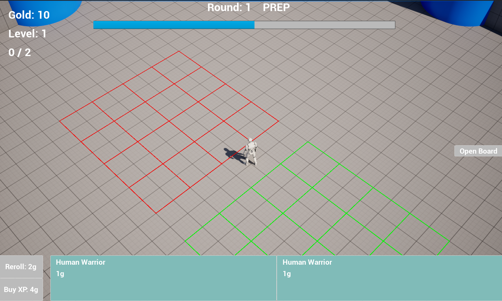
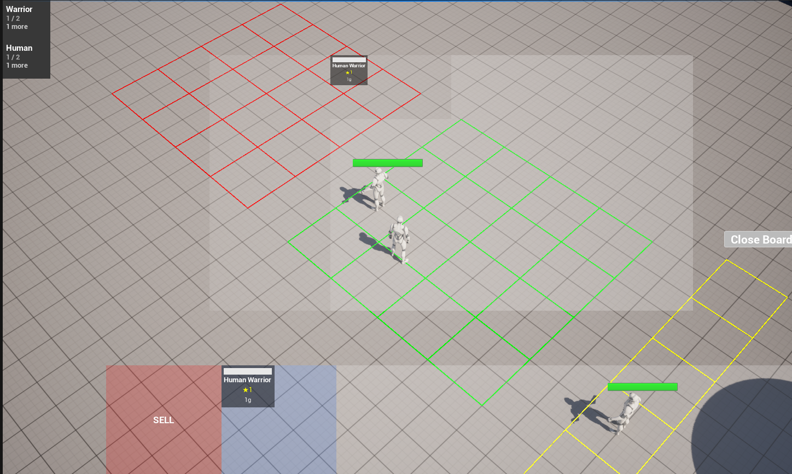
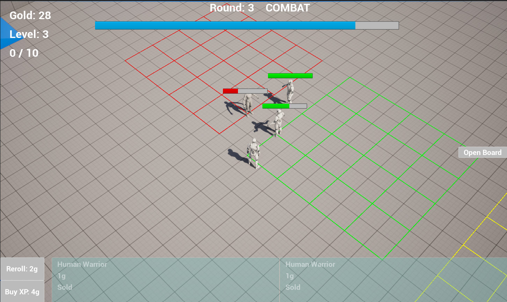
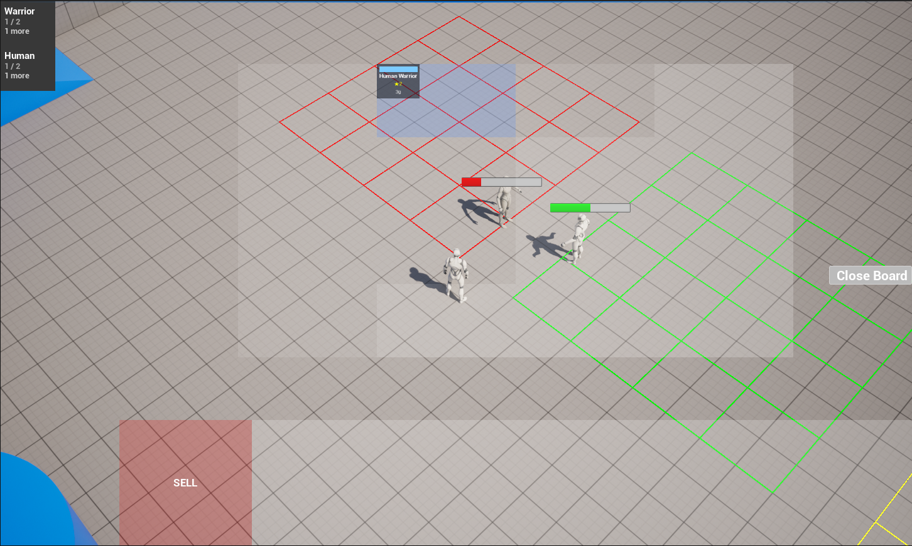
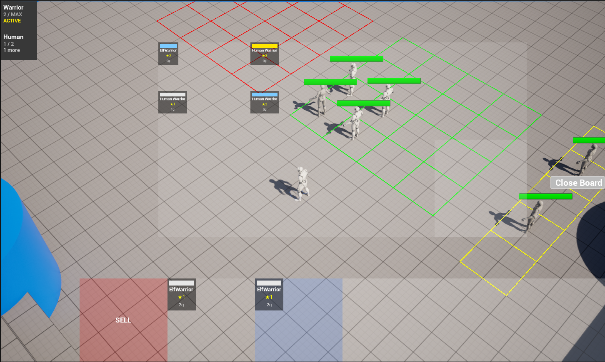

# TFT Clone

An auto-battler strategy game built in Unreal Engine 5 and C++, inspired by Teamfight Tactics.

Buy units from a shop, place them on a grid, and watch them auto-battle each round. Merge three copies of a unit to upgrade its star level, build trait synergies across your board, and climb gold and XP to expand your team.



---

## Core gameplay loop

The game runs through three phases on a repeating timer:

**Prep** — buy units from the shop, drag them from the bench onto your board, arrange your formation.



**Combat** — units automatically target the nearest enemy, move into range, and fight. No player input during this phase — your prep decisions play out.



**Result** — round outcome is shown, rewards are granted, and the next prep phase begins.

---

## Features

### Shop and economy
A weighted random shop with a five-tier rarity table that shifts as the player levels up — higher tiers become more likely at higher player levels, mirroring the real game's design. Units are drawn from a shared pool with a fixed number of copies, so buying a unit reduces its availability for the shop.

### Merging
Collect three copies of the same unit to automatically merge them into a single 2-star unit with significantly boosted stats. Three 2-star copies merge again into a 3-star. Works seamlessly across board and bench.

<table>
  <tr>
    <td align="center"><br/><sub>A unit being upgraded to the next star level</sub></td>
    <td align="center"><br/><sub>units from 1-star to 3-star</sub></td>
  </tr>
</table>

### Trait synergies
Units belong to a Race and a Class (e.g. Elf Warrior). Fielding multiple units that share a trait activates tiered bonuses — more units of the same trait unlocks stronger buffs, applied automatically to every unit contributing to that trait.


### Combat AI
Each unit independently finds the nearest living enemy, paths toward it using Unreal's navigation system, and attacks once in range. Damage is reduced by armor using a diminishing-returns formula. Combat ends when one side is wiped or the round timer expires.

### Drag and drop board management
Units are dragged between bench slots, board cells, and a sell zone using Unreal's native drag-drop framework. Board placement is locked during combat to prevent mid-fight repositioning.

---

## Content configuration

The game is single-player and fully data-driven — no code changes are needed to add new units or traits. Everything is configured in the Unreal Editor via Data Assets.

### Adding units
Create a new `UUnitDataAsset` and fill in the unit's stats, mesh, cost, and traits. Then assign the asset in the editor to either:
- **Player pool** — the unit becomes available in the player's shop draw.
- **Enemy pool** — the unit will spawn on the enemy side during combat rounds.

### Adding traits
Create a new trait definition and assign it a GameplayTag. Reference that tag in any `UUnitDataAsset` to make units carry the trait. Thresholds and stat buffs for each tier are configured on the trait definition itself. Traits only apply to player-side units — enemy units spawn with fixed stats.

---

## Architecture

Built around Unreal's **GameInstanceSubsystem** pattern — each major system (combat, shop, traits) is a self-contained subsystem that persists across the game session and communicates via delegates rather than direct references, keeping systems decoupled.

```
TFTGameMode
    │
    ├── CombatSubsystem    — phase timing, fight loop, win/loss detection
    ├── ShopSubsystem      — unit pool, rarity rolls, buy/sell
    ├── TraitSubsystem     — synergy counting and stat buffs
    ├── BattlefieldActor   — grid layout, cell occupancy
    └── TFTPlayerState     — gold, XP, level, board/bench ownership
```

UI listens to subsystem delegates (`OnPhaseChanged`, `OnShopRefresh`, `OnTraitsUpdated`, etc.) and refreshes reactively rather than being polled — the HUD, board, and synergy panel all stay in sync automatically as game state changes.

Units are data-driven via `UUnitDataAsset` — each unit type's stats, mesh, cost, and traits live in a Data Asset rather than hardcoded, so new units can be added without touching code.

---

## Tech stack

- **Unreal Engine 5.7**
- **C++** for all gameplay logic and subsystems

---

## Project structure

```
Source/CustomProject/
├── Combat/            — battlefield grid, combat phase loop
├── Player/            — player state: gold, XP, board/bench
├── Shop/              — unit pool, shop generation, buy/sell
├── Traits/            — trait definitions and synergy calculation
├── UI/                — all UMG widget C++ classes
├── Units/             — unit actor and data asset
├── TFTGameMode.cpp/.h — central hub wiring all systems together
└── UnitDragDrop.cpp/.h — drag-drop payload for unit cards
```

---

## Built for

Monash University — FIT2096 Game Programming
